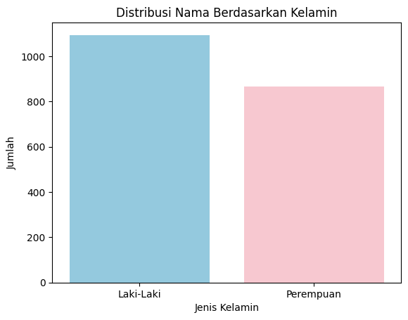

# Data Nama Masyarakat Indonesia
*Data Diolah untuk Mata Kuliah **Statistik dan Probabilitas***

Data yang disajikan adalah bentuk diagram dari beberapa case atau penerapan data mentah yaitu Nama dan Jenis Kelamin. Pengolahan dilakukan dengan mengambil data pada file [indonesian-names.csv](indonesian-names.csv) kemudian ditampilkan menggunakan kode program **Python** dan disajikan menggunakan **Jupyter Notebook**.

## Cara Menjalankan Program
1. Install Python.
2. Install VSCode.
3. Buka VSCode, install extension berikut: `Jupyter`, dan `Python`.
4. Git Clone / copy isi repository ini dengan cara running kode di terminal:
   ```bash
   git clone https://github.com/Rezdblz/uts-Statistik.git
   ```
5. Buka folder projek `uts-Statistik`.
6. Buka file `main.ipynb`
7. Klik **"Run All"** untuk menjalankan seluruh kode atau klik tombol **"Execute Cell"** pada sisi kiri kode untuk menjalankan satu per-satu.

Tools & Service:
- [Python 3.14.0](https://www.python.org/downloads/)
- [Jupyter Notebook](https://code.visualstudio.com/docs/datascience/jupyter-notebooks)
- [Visual Studio Code](https://code.visualstudio.com/)
- [Kaggle Datasets](https://www.kaggle.com/)

**Sumber Data:** [https://www.kaggle.com/datasets/dionisiusdh/indonesian-names](https://www.kaggle.com/datasets/dionisiusdh/indonesian-names)

---

### Distribusi Nama Berdasarkan Kelamin


### Frekuensi Banyak Kata dalam Sebuah Nama


### Diagram 1
### Diagram 1
### Diagram 1

---
## Kontributor
- [**Dimas Reza Ardhana**](https://github.com/Rezdblz/) (3124600102)
- [**Erik Triayuda Wijaya**](https://github.com/Quackeyikz/) (3124600094)